To help reduce the impact of numerical noise in certain simulations, the
delta-f method may be used in for specified particle species. The
delta-f method effectively subtracts a background distribution $f_0$
when calculating currents due to the motion of markers; when the
particle distribution function $f$ is close to $f_0$, this substantially
reduces the statistical noise in the currents. Only current deposition
is implemented differently, and the equations of motion of the markers
are not modified in this delta-f approach.

The component of the currents associated with the background $f_0$ may
be in principle be calculated analytically, but the delta-f
implementation in EPOCH assumes (but does not check) that the total
background current is zero.

In order to use the delta-f method EPOCH must be compiled with the
\#DELTAF_METHOD precompiler flag enabled. Standard input simulations
are not affected by switching on this flag, but the user may then choose
to treat certain species in the plasma using the delta-f method. To
enable delta-f calculation for a species the background distribution
function $f_0$ must be defined in the input block. $f_0$ is specified
using variables similar to those used to specify $f$. The current
implementation of delta-f allows only a spatially uniform drifting
Maxwellian $f_0$, with temperatures $T_x$, $T_y$ and $T_z$ allowed to
differ from each other. In 3D, for the case where the temperature in
each direction is equal, we have
$f_0 = n_0 (2 \pi T)^{-3/2} \exp\left(\frac{m (\mathbf{v} - \mathbf{v_d})^2}{2 k_B T } \right).$

The parameters number_density_back, temp(x,y,z)_back and
drift(x,y,z)_back in each species specification in the input deck set
$f_0$. number_density_back=0 is the default and is equivalent to not
using the delta-f method.

For example, the electron species component of an input deck solved
using delta-f might be written:

```perl
begin:species 
   name = electron 
   charge = -1.0 
   mass = 1.0 
   frac = 0.3 
   temp = 1e8 
   temp_back = 1e8 
   number_density = 1e20 
   number_density_back = 1e20 
end:species
```

Additional distribution function diagnostic options are supplied for the
Delta-f version. Standard diagnostics work as usual based on the total
distribution function $f$ but is is also possible to output the Delta-f
component of the distribution functions by adding output_deltaf = T in
dist_fn components of the input deck.

An example input deck is supplied in the 1D version as
twostream_deltaf.deck. This uses the delta-f method to solve the
weak-beam two stream instability. The bulk plasma species is solved
using the delta-f method, since this evolve very little, and mostly
supports the Lagnmuir waves that the weak beam interacts with. The
relative change to the beam species is large, and the standard PIC
method, rather than delta-f is used to model this species. A comparison
of the electric field diagnostics between standard and delta-f
simulations shows a substantial decrease in noise.

The rest of this page features slides detailing the model:

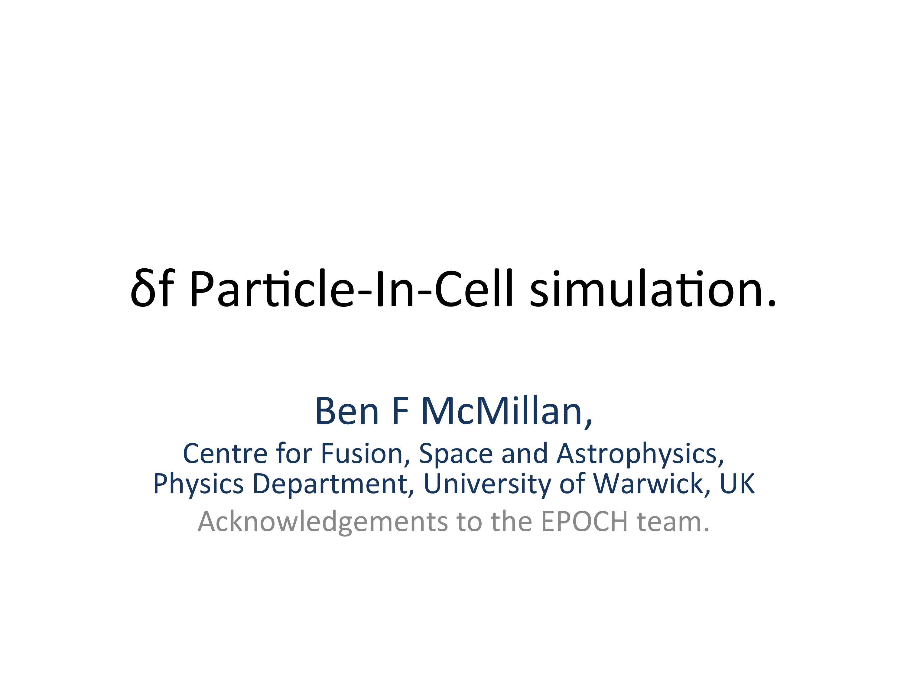


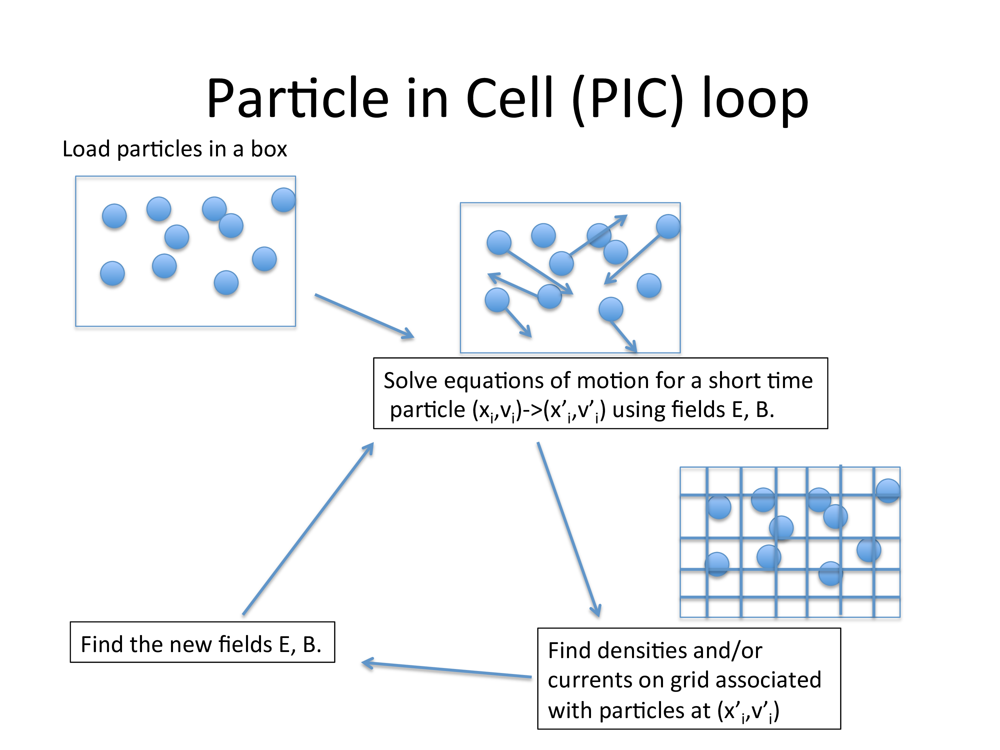

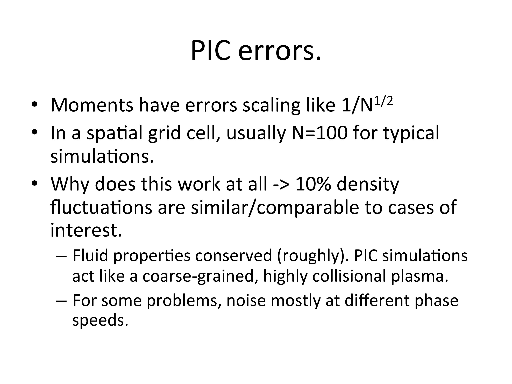
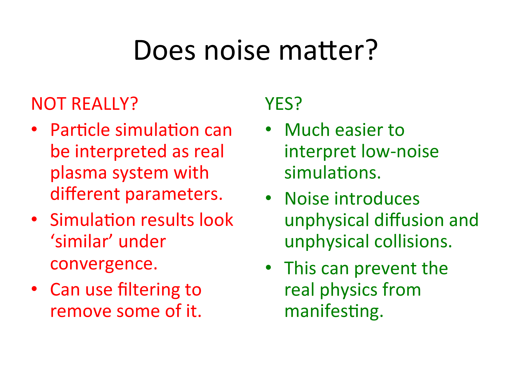
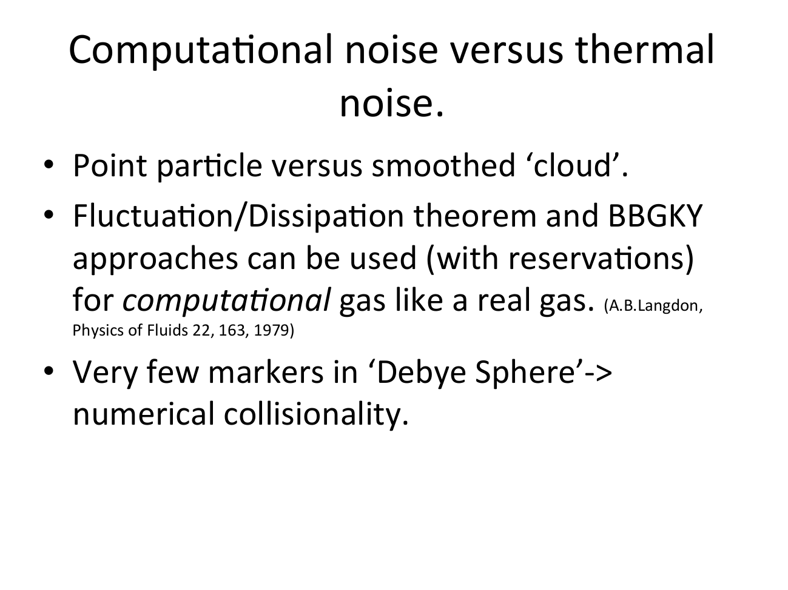


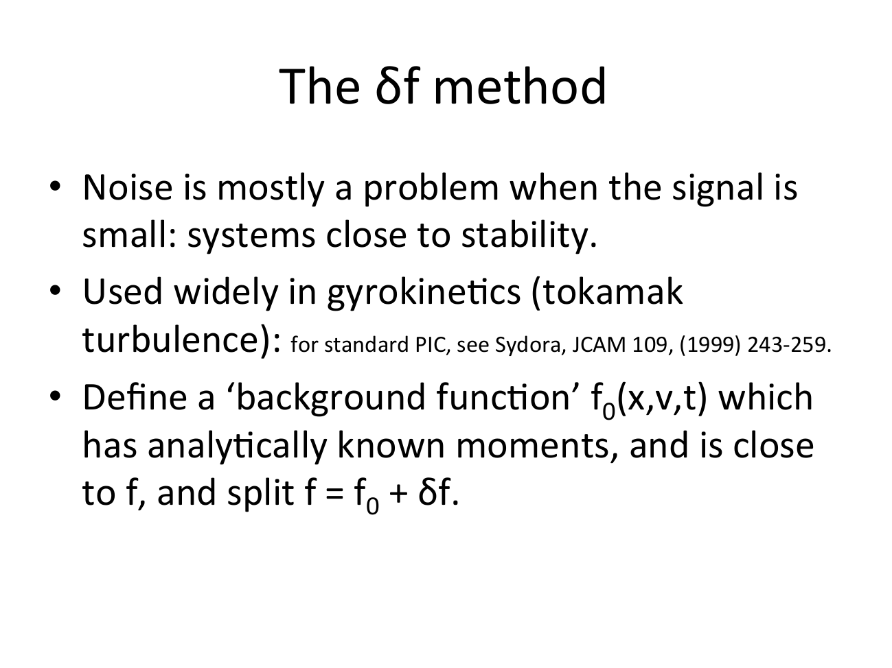

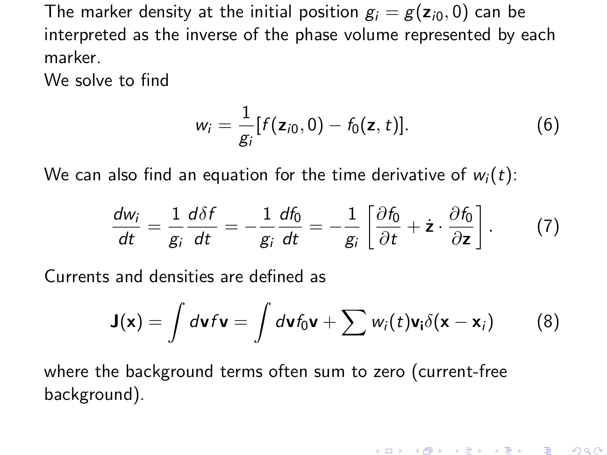
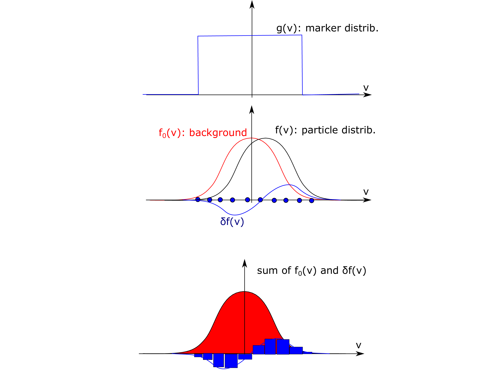
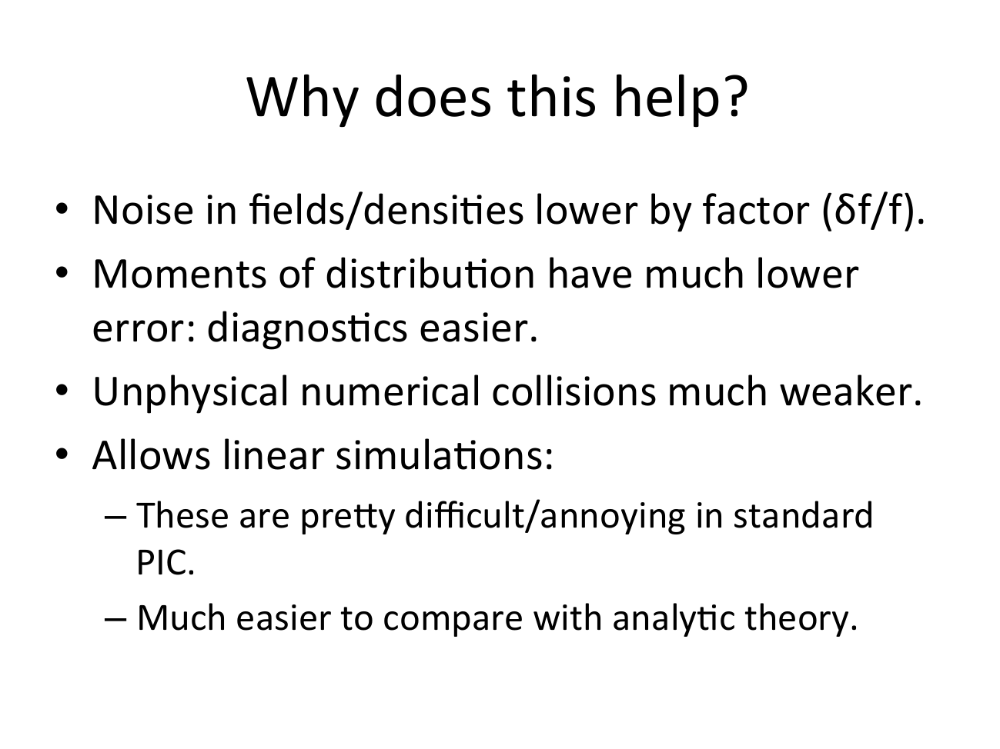
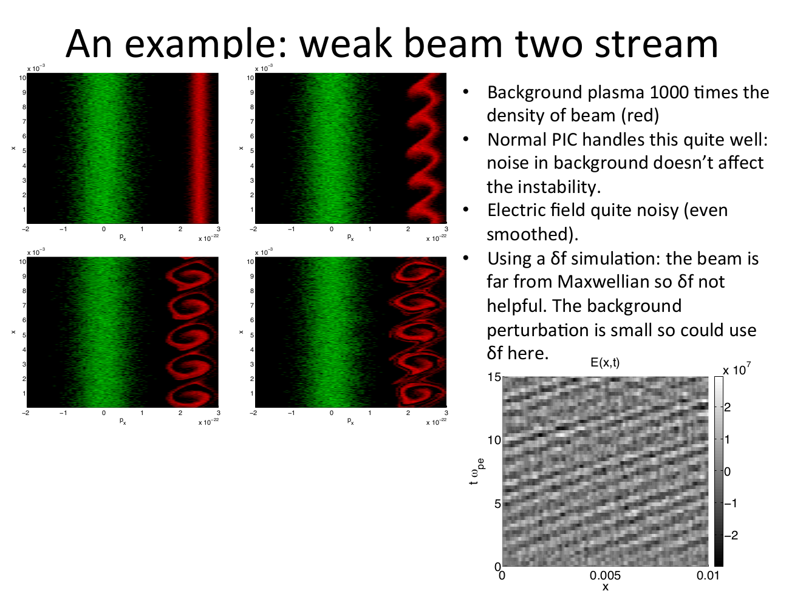

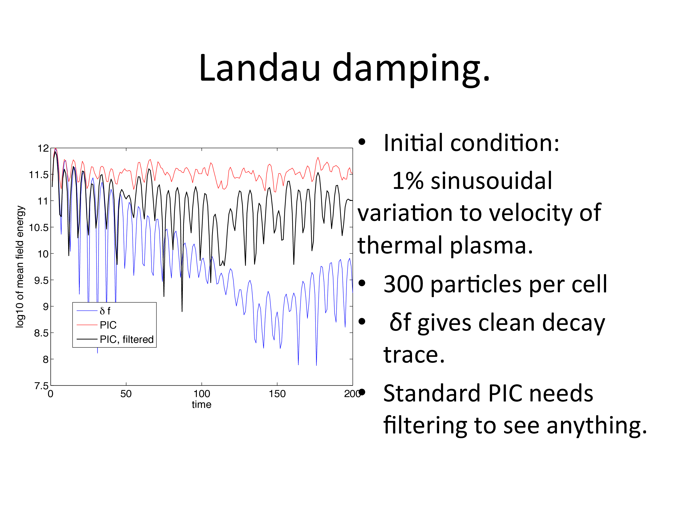
