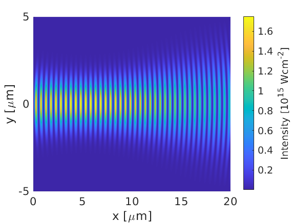

In this section we outline a few worked examples of setting up problems
using the EPOCH input deck.

# Electron two stream instability {#electron_two_stream_instability}

An obvious simple test problem to do with EPOCH is the electron two
stream instability. An example of a nice dramatic two stream instability
can be obtained using EPOCH1D by setting the code with the following
input deck file:

```perl
begin:control
   nx = 400

   # Size of domain
   x_min = 0
   x_max = 5.0e5

   # Final time of simulation
   t_end = 1.5e-1

   stdout_frequency = 400
end:control


begin:boundaries
   bc_x_min = periodic
   bc_x_max = periodic
end:boundaries


begin:constant
   drift_p = 2.5e-24
   temp = 273
   dens = 10
end:constant


begin:species
   # Rightwards travelling electrons
   name = Right
   charge = -1
   mass = 1.0
   temp = temp
   drift_x = drift_p
   number_density = dens
   npart = 4 * nx
end:species


begin:species
   # Leftwards travelling electrons
   name = Left
   charge = -1
   mass = 1.0
   temp = temp
   drift_x = -drift_p
   number_density = dens
   npart = 4 * nx
end:species


begin:output
   # Number of timesteps between output dumps
   dt_snapshot = 1.5e-3

   # Properties at particle positions
   particles = always
   px = always

   # Properties on grid
   grid = always
   ex = always
   ey = always
   ez = always
   bx = always
   by = always
   bz = always
   jx = always
   ekbar = always
   mass_density = never + species
   charge_density = always
   number_density = always + species
   temperature = always + species
end:output
```


In this example, the constant block sets up constants for the momentum
space drift, the temperature and the electron number density. The two
species blocks set up the two drifting Maxwellian distributions and the
constant density profile. The final output from this simulation is shown
in the figure.

# Structured density profile in EPOCH2D {#structured_density_profile_in_epoch2d}


A simple but useful example for EPOCH2D is to have a highly structured
initial condition to show that this is still easy to implement in EPOCH.
A good example initial condition would be:

```perl
begin:control
   nx = 500
   ny = nx
   x_min = -10 * micron
   x_max = -x_min
   y_min =  x_min
   y_max =  x_max
   nsteps = 0
end:control

begin:boundaries
   bc_x_min = periodic
   bc_x_max = periodic
   bc_y_min = periodic
   bc_y_max = periodic
end:boundaries

begin:constant
   den_peak = 1.0e19
end:constant

begin:species
   name = Electron
   number_density = den_peak * (sin(4.0 * pi * x / length_x + pi / 4)) \
                    * (sin(8.0 * pi * y / length_y) + 1)
   number_density_min = 0.1 * den_peak
   charge = -1.0
   mass = 1.0
   npart = 20 * nx * ny
end:species

begin:species
   name = Proton
   number_density = number_density(Electron)
   charge = 1.0
   mass = 1836.2
   npart = 20 * nx * ny
end:species

begin:output
   number_density = always + species
end:output
```

The species block for **Electron** is specified first, setting up the
electron density to be a structured 2D sinusoidal profile. The species
block for **Proton** is then set to match the density of **Electron**,
enforcing charge neutrality. On its own this initial condition does
nothing and so only needs to run for 0 timesteps (**nsteps = 0** in
input.deck). The resulting electron number density should look like the
figure.

# A hollow cone in 3D {#a_hollow_cone_in_3d}

A more useful example of an initial condition is to create a hollow
cone. This is easy to do in both 2D and 3D, but is presented here in 3D
form.

```perl
begin:control
   nx = 250
   ny = nx
   nz = nx
   x_min = -10 * micron
   x_max = -x_min
   y_min = x_min
   y_max = x_max
   z_min = x_min
   z_max = x_max
   nsteps = 0
end:control

begin:boundaries
   bc_x_min = simple_laser
   bc_x_max = simple_outflow
   bc_y_min = periodic
   bc_y_max = periodic
   bc_z_min = periodic
   bc_z_max = periodic
end:boundaries

begin:output
   number_density = always + species
end:output

begin:constant
   den_cone = 1.0e22
   ri = abs(x - 5.0e-6) - 0.5e-6
   ro = abs(x - 5.0e-6) + 0.5e-6
   xi = 3.0e-6 - 0.5e-6
   xo = 3.0e-6 + 0.5e-6
   r = sqrt(y^2 + z^2)
end:constant

begin:species
   name = proton
   charge = 1.0
   mass = 1836.2
   number_density = if((r gt ri) and (r lt ro), den_cone, 0.0)
   number_density = if((x gt xi) and (x lt xo) and (r lt ri), \
                       den_cone, number_density(proton))
   number_density = if(x gt xo, 0.0, number_density(proton))
   npart = nx * ny * nz
end:species

begin:species
   name = electron
   charge = -1.0
   mass = 1.0
   number_density = number_density(proton)
   npart = nx * ny * nz
end:species
```

#### Cone initial conditions in 3D {#3d_cone}


#### Cone initial conditions in 2D {#2d_cone}


To convert this to 2D, simply replace the line `r = sqrt(y^2+z^2)` with
the line `r = abs(y)`. The actual work in these initial conditions is
done by the three lines inside the block for the **Proton** species.
Each of these lines performs a very specific function:

1.  Creates the outer cone. Simply tests whether **r** is within the
    range of radii which corresponds to the thickness of the cone and if
    so fills it with the given density. Since the inner radius is x
    dependent this produces a cone rather than a cylinder. On its own,
    this line produces a pair of cones joined at the tip.
2.  Creates the solid tip of the cone. This line just tests whether the
    point in space is within the outer radius of the cone and within a
    given range in **x**, and fills it with the given density if true.
3.  Cuts off all of the cone beyond the solid tip. Simply tests if **x**
    is greater than the end of the cone tip and sets the density to zero
    if so.

This deck produces an initial condition as in the Figures in
[3D](#3d_cone) and [2D](#2d_cone)
respectively.

# Focussing a Gaussian Beam {#focussing_a_gaussian_beam}

A laser can be driven on the boundary so that it focusses on a given
spot. Basic details of how to do this are
[here](https://en.wikipedia.org/wiki/Gaussian_beam). To summarise, using
the paraxial approximation, the electric fields for a $x$-propagating,
$y$-polarised Gaussian beam take the form:

$\pmb{E}(r,x) = E_0 \frac{w_0}{w(x)} e^{-r^2/w(x)^2} e^{-i(kx + k\frac{r^2}{2R_c(x)}-\psi(x))} \hat{\pmb{y}}$ 

where
- $r$ is the radial distance from the laser propagation axis
- $x$ is axial distance along the wave, with $x=0$ at the focus
- $E_0$ is the peak electric field amplitude at the focus
- $w(x)$ is the beam-waist at $x$ (radial distance where field strength drops by $e^{-1}$)
- $w_0$ is $w(x=0)$
- $k$ is the laser wave-vector
- $R_c(x)$ is the radius of curvature at $x$
- $\psi(x)$ is the Gouy phase correction

If the fields on the simulation boundary are of this form, 
then the fields will propagate according to this equation, and 
a focal spot will be formed. Note that this propagation is only expected
provided the paraxial approximation is satisfied. This implies that, for vacuum propagation, the laser
wavelength, $\lambda$ is much smaller than the beam-waist: $\lambda << w_0$.

The following deck
gives an example for a laser attached to x_min. Two constant blocks are provided:
the first gives the user control over the focused laser properties, and the
second derives variables to be used in the laser block. The user only needs to
touch the first, which sets the intensity full-width-at-half-maximum (related to
beam-waist), the peak, cycle-averaged intensity, the laser wave-length and the
distance from the $x\_{min}$ boundary to the focal point.

```perl
begin:control
    nx = 2400
    ny = 1200
    t_end = 100e-15
    x_min = 0
    x_max = 20e-6
    y_min = -5e-6
    y_max = 5e-6
    stdout_frequency = 100
end:control

begin:boundaries
    bc_x_min = simple_laser
    bc_x_max = open
    bc_y_min = open
    bc_y_max = open
end:boundaries

begin:constant
    I_fwhm = 2.0e-6          # FWHM of laser intensity
    I_peak_Wcm2 = 1.0e15     # 0.5 * eps0 * c * E_peak^2
    las_lambda = 1.0e-6      # Laser wavelength
    foc_dist = 5.0e-6        # Boundary to focal point distance
end:constant

begin:constant
    las_k = 2.0 * pi / las_lambda    
    w0 = I_fwhm / sqrt(2.0 * loge(2.0))                  # Beam Waist
    ray_rang = pi * w0^2 / las_lambda                    # Rayleigh range
    w_boundary = w0 * sqrt(1.0 + (foc_dist/ray_rang)^2)  # Waist on boundary
    I_boundary = I_peak_Wcm2 * (w0 / w_boundary)^2       # Intens. on boundary
    rad_curve = foc_dist * (1.0 + (ray_rang/foc_dist)^2) # Boundary curv. rad.
    gouy = atan(-foc_dist/rad_curve)                     # Boundary Gouy shift
end:constant

begin:laser
    boundary = x_min
    intensity_w_cm2 = I_boundary
    lambda = las_lambda
    phase = las_k * y^2 / (2.0 * rad_curve) - gouy
    profile = gauss(y, 0, w_boundary)
end:laser

begin:output
    name = o1
    dt_snapshot = 10 * femto
    poynt_flux = always
end:output
```



In this example, EPOCH correctly reproduces the focal point position,
laser wavelength, and radial FWHM at the focus - however, the peak
intensity is only $0.88\times 10^{15} \text{Wcm}^{-2}$. This
intensity reduction from target is due to the tight focal spot, 
with $w_0\approx 1.7e-6$ being close to $\lambda = 1.0e-6$.

The deck is based on the laser test deck supplied with EPOCH, with a
modified laser and longer runtime. Other classes of beam (Bessel etc)
can be created similarly.

# Injecting the laser at an angle {#angle_laser_injection}

By setting up a phase shift as a function of space, it is possible to force
wavefronts to arrive at different points on the boundary at different times
(for 2D and 3D simulations). This allows the user to inject lasers with an
angle to the boundary normal.

#### Angled incident laser profile {#laser_angled}


The setup for this is not entirely straightforward and requires a little
bit of explanation. The above [figure](#laser_angled) illustrates a laser being driven at
an angle on the $x_{min}$ boundary. Different wave fronts cross the $y$-axis
at different places and this forms a sinusoidal profile along $y$ that
represents the phase. The wavelength of this profile is
given by $\lambda_\phi = \lambda / \sin\theta$, where $\lambda$ is the
wavelength of the laser and $\theta$ is the angle of the propagation
direction with respect to the $x$-axis. The actual phase to use will
be $\phi(y) = -k_\phi y = -2\pi y / \lambda_\phi$. It is negative because
the phase of the wave is propagating in the positive $y$ direction.
It is also necessary to alter the wavelength of the driver since this
is given in the direction perpendicular to the boundary. The new
wavelength to use will be $\lambda\cos\theta$. The [figure](#laser_angled) shows
the resulting $E_y$ field for a laser driven at an angle of $\pi / 6$. Note
that since the boundary conditions in the code are derived for propagation
perpendicular to the boundary, there will be artefacts on the scale of the
grid for lasers driven at an angle.

The input deck used to generate this figure is given below:

```perl
begin:control  
  nx = 2000          
  ny = 2000             
  t_end = 50.e-15      
  x_min = -10.0e-6    
  x_max = 10.0e-6      
  y_min = -10.0e-6
  y_max = 10.0e-6  
end:control  
  
begin:boundaries  
  bc_x_min = simple_laser  
  bc_x_max = simple_outflow  
  bc_y_min = simple_outflow  
  bc_y_max = simple_outflow
end:boundaries  
 
begin:constant  
  laser_angle = pi / 6      # Set angle of laser w.r.t positive x unit vector
  laser_fwhm = 2.0e-6       # Size of gaussian profile for laser electric field
  laser_wavelength = 1.0e-6
  laser_k = 2 * pi / laser_wavelength
end:constant  
  
begin:laser 
  boundary = x_min 
  intensity_w_cm2 = 1.0e15 
  profile = gauss(y, 0, laser_fwhm / (2.0 * sqrt(loge(2.0))))
  t_profile = 1
  phase = -y * laser_k * sin(laser_angle) # Vary wave-front position in space
  lambda = laser_wavelength * cos(laser_angle) # Space wave-fronts apart 
                                               # correctly along k
end:laser    
 
begin:output
  dt_snapshot = 10.e-15   
  grid = always 
  ey = always  
end:output  

```