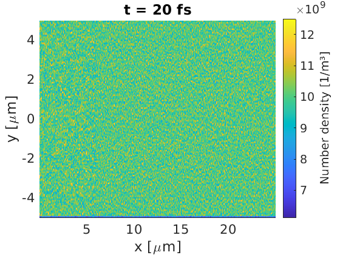
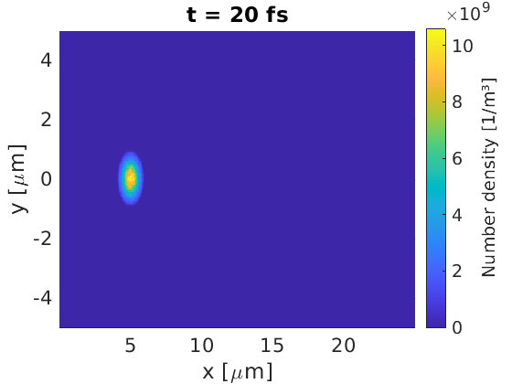
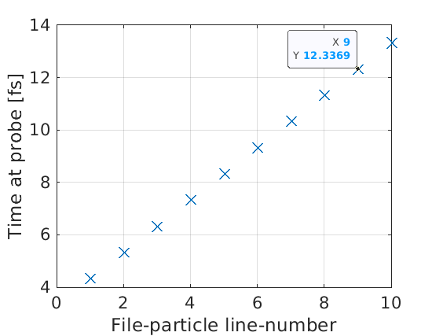

It is possible to add macro-particles to the simulation window after the initial
macro-particle load using the 
[injector block](/documentation/input_deck/input_deck_injector.html). 
This can be done to simulate a particle 
beam passing through a boundary, or to replace macro-particles on the boundary 
of a flowing plasma volume. EPOCH provides support for two styles of injectors,
one which is specified by plasma properties, and the other which reads particles
from files.

## Basic plasma injector

To demonstrate the basic injector syntax, we have created a simple example. Here
we inject macro-electrons through the `x_min` boundary, such that all electrons 
have the same momentum, and the macro-particle weights are chosen to ensure the
injected density is $10^{10} \text{ m}^{-3}$. No macro-particles are initially 
loaded into the simulation window.

```
begin:control
    nx = 500
    ny = 200
    t_end = 20.0e-15
    x_min = 0
    x_max = 25e-6
    y_min = -5e-6
    y_max = 5e-6
    stdout_frequency = 100
end:control

begin:boundaries
    bc_x_min = open
    bc_x_max = open
    bc_y_min = open
    bc_y_max = open
end:boundaries

begin:species
    name = Electron
    mass = 1.0
    charge = -1.0
end:species

begin:injector
   boundary = x_min
   species = Electron
   number_density = 1.0e10
   drift_x = 1.0e-20
   npart_per_cell = 10
end:injector

begin:output
    dt_snapshot = t_end
    number_density = always
end:output
```


This figure shows macro-particles have been injected through the `x_min` 
boundary, 
with weights set to match the desired density.

## Flowing plasma injector

If we set up a problem where a flowing plasma fills the simulation window, then 
the plasma will start to flow through a boundary after the initial load. As 
this happens, macro-particles will exit the simulation on one side, leaving a 
vacuum on the other side. If we added an injector to the vacuum side, then we 
can introduce a source of new macro-particles to replace the lost 
macro-particles. To do this, we can set the temperature and number density of
the injector to match that of the initial plasma.

```
begin:control
    nx = 500
    ny = 200
    t_end = 20.0e-15
    x_min = 0
    x_max = 25e-6
    y_min = -5e-6
    y_max = 5e-6
    stdout_frequency = 100
end:control

begin:boundaries
    bc_x_min = open
    bc_x_max = open
    bc_y_min = open
    bc_y_max = open
end:boundaries

begin:species
    name = Electron
    mass = 1.0
    charge = -1.0
    npart = nx * ny * 10
    drift_x = 1.0e-20
    temp_ev = 1.0e3
    number_density = 1.0e10
end:species

begin:injector
   boundary = x_min
   species = Electron
   number_density = 1.0e10
   drift_x = 1.0e-20
   temp_ev = 1.0e3
   npart_per_cell = 10
end:injector

begin:output
    dt_snapshot = t_end
    number_density = always
end:output
```



Here we see that the plasma density is still uniform, even though the plasma
is drifting towards `x_max`. Particles above $6\text{ }\mu\text{m}$ were loaded
at the start of the simulation, and those below have been replaced with 
injectors. No sign of discontinuity on the injector/initial macro-particle 
boundary is present. 

## Particle bunch injection

The profile of the injector can be modified to introduce spatial and temporal 
variation, which would be useful for describing injected particle bunches.
We can set a Gaussian profile using the `gauss(x,x0,w)` function in the
[maths parser](/documentation/code_details/maths_parser.html), which represents

$e^{-(x-x_0)^2/w^2}$

In this formula, $w$ is related to the Gaussian full-width-at-half-maximum 
according to

$w = \frac{fwhm}{2\sqrt{\ln 2}}$

For the temporal profile, let us simulate the full-width-at-10%-maximum. This 
means the peak should arrive in the simulation at the half-width-at-10%-maximum
time, given by

$hw0.1m = \frac{fwhm}{2} \sqrt{\frac{\ln(10)}{\ln(2)}}$

```
begin:control
    nx = 500
    ny = 200
    t_end = 20.0e-15
    x_min = 0
    x_max = 25e-6
    y_min = -5e-6
    y_max = 5e-6
    stdout_frequency = 100
end:control

begin:boundaries
    bc_x_min = open
    bc_x_max = open
    bc_y_min = open
    bc_y_max = open
end:boundaries

begin:species
    name = Electron
    mass = 1.0
    charge = -1.0
end:species

begin:constant
    x_fwhm = 1.0e-6
    y_fwhm = 1.0e-6
    t_fwhm = x_fwhm / c
    w_t = t_fwhm / (2.0 * sqrt(loge(2)))
    w_y = y_fwhm / (2.0 * sqrt(loge(2)))
    t_hw01m = 0.5 * t_fwhm * sqrt(loge(10) / loge(2))
end:constant

begin:injector
   boundary = x_min
   species = Electron
   number_density = 1.0e10 * gauss(y,0,w_y) * gauss(time,t_hw01m,w_t)
   number_density_min = 1.0e9
   t_start = 0
   t_end = 2.0 * t_hw01m
   drift_x = 1.0e-20
   temp_ev = 1.0e3
   npart_per_cell = 10
end:injector

begin:output
    dt_snapshot = t_end
    number_density = always
end:output
```



The injected pulse is seen to have the desired properties. Note that we have 
introduced a threshold density for macro-particle injection with

```
number_density_min = 1.0e9
```

This line ensures that profiled densities below this value will not load 
macro-particles into the simulation. This prevents the code from loading too 
many low-weight macro-particles which would slow down the code.

## File injectors

If the in-built density, temperature and drift do not provide the desired 
injection behaviour, or if you're trying to inject specific particles from a 
different simulation, then you may find file-injectors useful. Here the user
can specify the injection time, position and momentum of each injected
macro-particle from file. Unlike other file-packages in EPOCH, the 
file-injectors read from simple text files.

For this simple example, let us inject a macro-electron of weight 10 into a
2D simulation window each femtosecond. The momenta of these macro-particles will
be set such that they are highly relativistic, with a speed close to $c$. To 
check if they have been injected correctly, let us insert a particle probe 
one micron from the injection boundary. Let us also use the `-DPROBE_TIME`
compiler flag to see the exact time macro-particles pass the probe. See the 
section on [compiler flags](/documentation/basic_usage/compiler_flags.html) 
for help with switching on the probe-time capability.

We need to use separate files for each macro-particle variable, and particles
must be listed in chronological order of injection. For this demonstration, the
files contain:

inject_t.txt
```
1.0e-15
2.0e-15
3.0e-15
4.0e-15
5.0e-15
6.0e-15
7.0e-15
8.0e-15
9.0e-15
10.0e-15
```

inject_w.txt
```
10
10
10
10
10
10
10
10
10
10
```

inject_y.txt
```
0
0
0
0
0
0
0
0
0
0
```

inject_px.txt
```
1.0e-20
1.0e-20
1.0e-20
1.0e-20
1.0e-20
1.0e-20
1.0e-20
1.0e-20
1.0e-20
1.0e-20
```

and the input.deck reads:

```
begin:control
    nx = 500
    ny = 200
    t_end = 20.0e-15
    x_min = 0
    x_max = 25e-6
    y_min = -5e-6
    y_max = 5e-6
    stdout_frequency = 100
end:control

begin:boundaries
    bc_x_min = open
    bc_x_max = open
    bc_y_min = open
    bc_y_max = open
end:boundaries

begin:species
    name = Electron
    mass = 1.0
    charge = -1.0
end:species

begin:injector
    boundary = x_min
    species = Electron
    inject_from_file = T 
    y_data = "inject_y.txt"
    px_data = "inject_px.txt"
    w_data = "inject_w.txt"
    t_data = "inject_t.txt"
end:injector

begin:output
    dt_snapshot = t_end
    particle_probes = always
end:output

begin:probe
   name = Electron_probe
   point = (1.0e-6, 0.0)
   normal = (1.0, 0.0)
   ek_min = 0.0
   ek_max = -1.0
   include_species:Electron
   dumpmask = always
end:probe
```

For injector files, the code will look in the same directory as the input.deck
file. The full path is not required like in other file-reading blocks. If we 
open `0001.sdf` (possibly using the GetDataSDF.m function in 
`epoch/SDF/Matlab`), we see the times each macro-particle passes the probe. We 
can label each macro-particle by its line in the injector files, and we can 
obtain a probe-time vs file-line plot



Due to the position of the probe, and the speed of the macro-particles, we 
expect these probe times to be 3.337 fs after the particle injection time. This
matches the behaviour seen in the probe data, which shows that the file
injectors are working as intended.