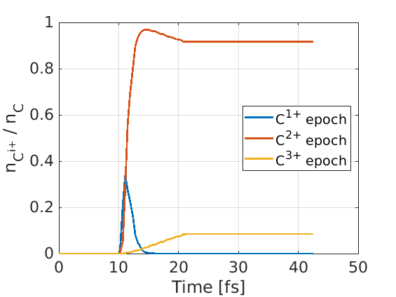

Particles within an EPOCH simulation have the option to be ionised through 
either field ionisation, or electron-impact collisional ionisation. The keys 
required to set up ionisation are found in multiple blocks, and a summary may be
found in the [species block](/documentation/input_deck/input_deck_species.html) 
documentation. This page provides simple demos for the ionisation packages.

In general, the user defines an initial ion species, and the code automatically 
generates species for the ionised states. During ionisation, a bound electron is
released from an ion, and added to an electron species as a macro-particle.

## Field ionisation

In field ionisation, ions are created in the presence of strong laser fields. In
this 1D input deck, a laser moves from the `x_min` boundary towards a block of
neutral carbon. EPOCH can identify the ion species as neutral carbon, as the 
`charge` and `atomic_no` have been specified in the 
[species block](/documentation/input_deck/input_deck_species.html). 

The species 
block also tells EPOCH that the `Carbon` species can be ionised since the 
`ionise = T` line is provided. The number of possible ionisation states has been 
manually cut-off at 3 by the `ionise_limit` key. When an ionisation occurs, a
new macro-electron is generated and assigned to a species which will be 
automatically generated, as specified by `unique_electron_species = T`.

Once the ionisation keys in the species block have been activated, we need to 
tell EPOCH what kind of ionisation should occur. Here, we switch on the field 
ionisation process using the 
[control block](/documentation/input_deck/input_deck_control.html) key 
`field_ionisation`.

```
begin:control
  nx = 128
  npart = 20 * nx
  t_end = 42.4e-15
  x_min = 0
  x_max = 4.0e-6
  field_ionisation = T
end:control

begin:boundaries
  bc_x_min = simple_laser
  bc_x_max = open
end:boundaries

begin:laser
  boundary = x_min
  intensity = 3.0e15 * 1.0e4
  lambda = 800.0e-9
  t_profile = 1
  t_end = 10.7e-15
end:laser

begin:species
  name = Carbon
  charge = 0
  atomic_no = 6
  mass = 1836.2 * 16.0
  frac = 1
  rho = if ((x lt 3.30e-6) and (x gt 3.05e-6), 1.74e24, 0)
  ionise = T
  ionise_limit = 3
  unique_electron_species = T  
end:species

begin:output
  dt_snapshot = t_end/100
  number_density = always + species
end:output
```

Once the `input.deck` directory has been selected, `EPOCH` prints:

```
 Name of species 1 is Carbon
 Name of species 2 is Carbon1
 Name of species 3 is electron_from_Carbon
 Name of species 4 is Carbon2
 Name of species 5 is electron_from_Carbon1
 Name of species 6 is Carbon3
 Name of species 7 is electron_from_Carbon2
 Initial conditions complete and valid.
 Redistributing.          Balance: 0.254,     after: 0.507 (pre-load balance)
 Attempting to load particles
 Loaded 2560 particles of species "Carbon"
```

Here we see that although only one species is present in the `input.deck`, EPOCH
has generated species for Carbon with charge-states 1-3. If we had not included
`ionise_limit`, we would have generated species up to fully ionised Carbon.
Also, by setting `unique_electron_species = T`, the code has generated species 
for electrons released by specific ions during ionisation. We also see no 
macro-particles have been initially loaded into these automatically generated 
species, as only Carbon has a specified density in the `input.deck`.

Once the simulation is complete, we can plot the number densities of each
species at different times. As can be seen below, the system originally starts 
with only neutral carbon present, but ends with carbon ions of charge-state 2 
and 3 after illumination by the laser. 


We can also plot the fraction of carbon ions in each charge-state as a function
of time:



## Collisional ionisation

In collisional ionisation, ions undergo ionisation through collisions with 
electrons. In this simulation, the domain is filled with an equal number of electrons and 
neutral carbon atoms, and collisional ionisation between the two species 
generates carbon ions and ejected electrons.

As in the field ionisation example, the `Carbon` species uses 
`ionise = T` to identify the species as one which can ionise. Without 
`ionise_limit`, we allow ionisation up to fully-ionised carbon. In this example,
we create an empty electron species `Ejected_electron`, which will be used to
store macro-electrons which are ejected from ions during ionisation.

As collisional ionisation refers to ionisation when electrons hit ions, the code
needs to know which species are electron species. For the `Electron_beam`
species, the line `identify:electron` tells EPOCH the species can trigger
collisional ionisation. Also, EPOCH knows `Ejected_elctron` is an electron
species, because it is identified as a species to populate with electrons
ejected in the ionisation process from carbon ions.

Collisional ionisation is switched on using the `collisional_ionisation=T` line
in the [collisions block](/documentation/input_deck/input_deck_collisions.html).
Note that this does not switch on Coulomb scatter collisions between species, as 
this is a separate process from collisional ionisation.

```
begin:control
  nx = 128
  npart = 200 * nx
  t_end = 300.0e-15
  x_min = 0
  x_max = 4.0e-6
end:control

begin:boundaries
  bc_x_min = periodic
  bc_x_max = periodic
end:boundaries

begin:collisions
  collisional_ionisation = T 
end:collisions

begin:species
  name = Electron_beam
  frac = 0.5
  rho = 2.0e24
  temp_ev = 80
  identify:electron
end:species

begin:species
  name = Carbon
  charge = 0
  atomic_no = 6
  mass = 1836.2 * 16.0
  frac = 0.5
  rho = 2.0e24
  ionise = T
  electron_species = Ejected_electron    
end:species

begin:species
  name = Ejected_electron
  frac = 0
  charge = -1
  mass = 1
end:species

begin:output
  dt_snapshot = t_end/100
  number_density = always + species
end:output
```

When we run this simulation, EPOCH prints the lines:

```
 Name of species 1 is Electron_beam
 Name of species 2 is Carbon
 Name of species 3 is Ejected_electron
 Name of species 4 is Carbon1
 Name of species 5 is Carbon2
 Name of species 6 is Carbon3
 Name of species 7 is Carbon4
 Name of species 8 is Carbon5
 Name of species 9 is Carbon6
```

where the ionisation species Carbon1-Carbon6 have been automatically generated.
Initially these ionised carbon particle species contain no macro-particles.

This simulation generates some Carbon1 ions and a small number of Carbon2. The 
collisional ionisation cross section is too low here to ionise to the higher 
charge states. A plot of the population fraction over time is given here:

