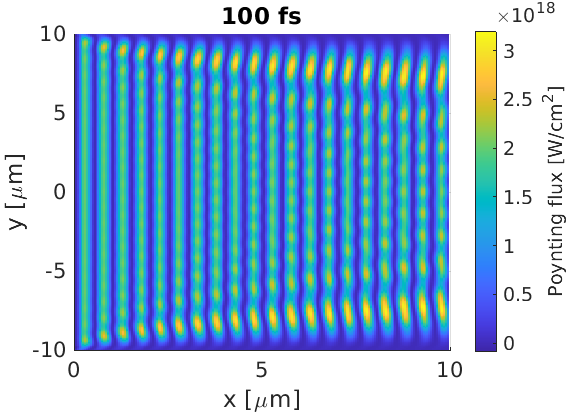

EPOCH can support laser sources on the boundaries, with a wide array of spatial 
and temporal profiles. These examples provide basic input decks for simulating 
lasers in vacuum. General documentation on the EPOCH laser block can be found 
[here](/documentation/input_deck/input_deck_laser.html).

## Simple plane wave

This input deck provides the most basic form of laser. We use uniform spatial
and temporal profiles, and inspect the Poynting flux in the simulation window.
As a typical rule of thumb, allow 20 cells per wavelength to get a good 
resolution.

```perl
begin:control
    nx = 200
    ny = 400
    t_end = 100e-15
    x_min = 0
    x_max = 10e-6
    y_min = -10e-6
    y_max = 10e-6
    stdout_frequency = 100
end:control

begin:boundaries
    bc_x_min = simple_laser
    bc_x_max = open
    bc_y_min = open
    bc_y_max = open
end:boundaries

begin:laser
    boundary = x_min
    intensity_w_cm2 = 1.0e18
    lambda = 1.0e-6
end:laser

begin:output
    dt_snapshot = 10 * femto
    poynt_flux = always
end:output
```



As we have specified a time-averaged intensity of $10^{18} \text{ Wcm}^{-2}$, we
expect the Poytning flux to range 0 to $2\times 10^{18} \text{ Wcm}^{-2}$, which 
we can see here. Note that, because our laser profile reaches the $y_{min}$ and 
$y_{max}$ boundaries, some noise has been introduced here. In practice, these 
boundary effects are less of an issue, as simulations are expected to mainly
deal with laser pulses.

## Laser pulse

Using the maths parser, we can create a laser pulse which has a Gaussian profile
in time and space for the intensity distribution, $I$: 

$ I(y,t) \propto e^{-(y-y_0)^2/2\sigma_y^2} e^{-(t-t_0)^2/2\sigma_t^2}$

where we consider a 2D simulation with an $x$ propagating laser.

Let the full-width-at-half-maximum of the
spatial and temporal profiles be 5 $\mu m$ and 40 fs respectively for the 
intensity $I$ distribution. The relationship between $\sigma$ and the $fwhm$
for a Gaussian distribution is:

$\sigma = \frac{fwhm}{2\sqrt{2 \ln(2)}}$

However, the profile 
keys in the laser block describe modifications to the boundary electric fields,
$E$, and as $I \propto E^2$, the $E$ profile must satisfy

$ E(y,t) \propto e^{-((y-y_0)/2\sigma_y)^2} e^{-((t-t_0)/2\sigma_t)^2}$

The EPOCH [maths parser](/documentation/code_details/maths_parser.html) provides
a special `gauss(x,x_0,w)` command for use in the input.deck, which sets a
profile of the form:

$e^{-(x-x_0)^2/w^2}$

Hence, we may use this `gauss` function to model the electric field profiles if
we set

$w = \frac{fwhm}{\sqrt{2\ln(2)}}$

where $fwhm$ refers to the _intensity_ distribution.

We can let the spatial profile peak at $y=0$. We don't want the laser to peak at
$t=0$, as this would ignore the rising intensity. Instead, let us start when the
laser pulse is 10% of its maximum value - the half-width-at-10%-maximum,
$hw0.1m$. For a Gaussian beam, this is:

$hw0.1m = \frac{fwhm}{2} \sqrt{\frac{\ln(10)}{\ln(2)}}$ 

```perl
begin:control
    nx = 700
    ny = 400
    t_end = 100e-15
    x_min = 0
    x_max = 35e-6
    y_min = -10e-6
    y_max = 10e-6
    stdout_frequency = 100
end:control

begin:boundaries
    bc_x_min = simple_laser
    bc_x_max = open
    bc_y_min = open
    bc_y_max = open
end:boundaries

begin:constant
    t_fwhm = 40.0e-15
    y_fwhm = 5.0e-6
    w_t = t_fwhm / sqrt(2*loge(2))
    w_y = y_fwhm / sqrt(2*loge(2))
    t_hw01m = 0.5 * t_fwhm * sqrt(loge(10)/loge(2))
end:constant

begin:laser
    boundary = x_min
    intensity_w_cm2 = 1.0e18
    lambda = 1.0e-6
    profile = gauss(y,0,w_y)
    t_profile = gauss(time,t_hw01m,w_t)
end:laser

begin:output
    dt_snapshot = 10 * femto
    poynt_flux = always
end:output
```


Here we see that the laser $fwhm$ in $x$ and $y$ are 12 $\mu m$ and 5 $\mu m$ 
respectively, where the $x$ $fwhm$ corresponds to a temporal FWHM of 40 fs, as
expected. Also, because there is little contact between the pulse and the 
boundaries, we do not have any numerical boundary disturbance.

## Focussing a Gaussian Beam {#focussing_a_gaussian_beam}

A laser can be driven on the boundary so that it focusses on a given
spot. Basic details of how to do this are
[here](https://en.wikipedia.org/wiki/Gaussian_beam). To summarise, using
the paraxial approximation, the electric fields for a $x$-propagating,
$y$-polarised Gaussian beam take the form:

$\pmb{E}(r,x) = E_0 \frac{w_0}{w(x)} e^{-r^2/w(x)^2} e^{-i(kx + k\frac{r^2}{2R_c(x)}-\psi(x))} \hat{\pmb{y}}$ 

where
- $r$ is the radial distance from the laser propagation axis
- $x$ is axial distance along the wave, with $x=0$ at the focus
- $E_0$ is the peak electric field amplitude at the focus
- $w(x)$ is the beam-waist at $x$ (radial distance where field strength drops by $e^{-1}$)
- $w_0$ is $w(x=0)$
- $k$ is the laser wave-vector
- $R_c(x)$ is the radius of curvature at $x$
- $\psi(x)$ is the Gouy phase correction

If the fields on the simulation boundary are of this form, 
then the fields will propagate according to this equation, and 
a focal spot will be formed. Note that this propagation is only expected
provided the paraxial approximation is satisfied. This implies that, for vacuum propagation, the laser
wavelength, $\lambda$ is much smaller than the beam-waist: $\lambda << w_0$.

The following deck
gives an example for a laser attached to x_min. Two constant blocks are provided:
the first gives the user control over the focused laser properties, and the
second derives variables to be used in the laser block. The user only needs to
touch the first, which sets the intensity full-width-at-half-maximum (related to
beam-waist), the peak, cycle-averaged intensity, the laser wave-length and the
distance from the $x\_{min}$ boundary to the focal point.

```perl
begin:control
    nx = 2400
    ny = 1200
    t_end = 100e-15
    x_min = 0
    x_max = 20e-6
    y_min = -5e-6
    y_max = 5e-6
    stdout_frequency = 100
end:control

begin:boundaries
    bc_x_min = simple_laser
    bc_x_max = open
    bc_y_min = open
    bc_y_max = open
end:boundaries

begin:constant
    I_fwhm = 2.0e-6          # FWHM of laser intensity
    I_peak_Wcm2 = 1.0e15     # 0.5 * eps0 * c * E_peak^2
    las_lambda = 1.0e-6      # Laser wavelength
    foc_dist = 5.0e-6        # Boundary to focal point distance
end:constant

begin:constant
    las_k = 2.0 * pi / las_lambda    
    w0 = I_fwhm / sqrt(2.0 * loge(2.0))                  # Beam Waist
    ray_rang = pi * w0^2 / las_lambda                    # Rayleigh range
    w_boundary = w0 * sqrt(1.0 + (foc_dist/ray_rang)^2)  # Waist on boundary
    I_boundary = I_peak_Wcm2 * (w0 / w_boundary)^2       # Intens. on boundary
    rad_curve = foc_dist * (1.0 + (ray_rang/foc_dist)^2) # Boundary curv. rad.
    gouy = atan(-foc_dist/rad_curve)                     # Boundary Gouy shift
end:constant

begin:laser
    boundary = x_min
    intensity_w_cm2 = I_boundary
    lambda = las_lambda
    phase = las_k * y^2 / (2.0 * rad_curve) - gouy
    profile = gauss(y, 0, w_boundary)
end:laser

begin:output
    name = o1
    dt_snapshot = 10 * femto
    poynt_flux = always
end:output
```


In this example, EPOCH correctly reproduces the focal point position,
laser wavelength, and radial FWHM at the focus - however, the peak
intensity is only $0.88\times 10^{15} \text{ Wcm}^{-2}$. This
intensity reduction from target is due to the tight focal spot, 
with $w_0\approx 1.7$ μm being close to $\lambda = 1.0$ μm.

The deck is based on the laser test deck supplied with EPOCH, with a
modified laser and longer runtime. Other classes of beam (Bessel etc)
can be created similarly.
