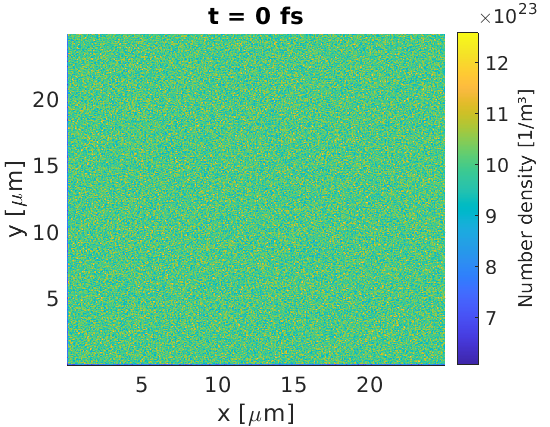
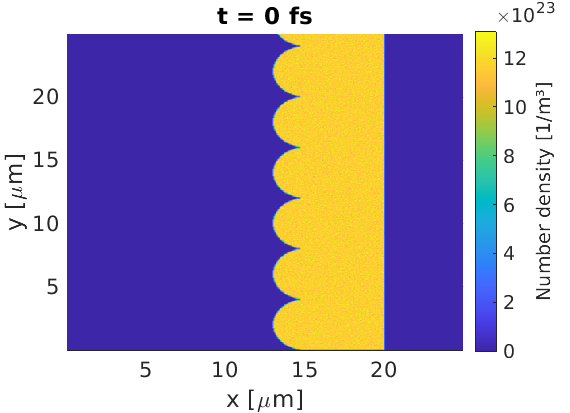
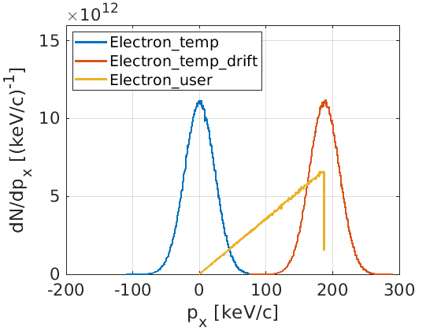

Particles in EPOCH belong to particle species which can be controlled by the 
[species block](/documentation/input_deck/input_deck_species.html). In these 
examples, we show how to load macro-particles in various configurations. 
These macro-particle objects 
behave as single particles in the code, but represent many real particles 
for the current solver. The examples on this page set up simulations in epoch2d,
but they may be modified for use in the 1d or 3d codes.

## Uniform load

This basic input deck sets up a uniform density of electrons over the full 
simulation window. We create 10 macro-particles per cell, for a density of 
$10^{24}\text{ m}^{-3}$. The cell sizes are $dx = dy = 50\text{ nm}$ and 
$dz = 1 \text{ m}$, since cell sizes in omitted dimensions default to 1 metre.
Hence, we expect $2.5\times 10^9$ real electrons per cell, so each
macro-electron should represent around $2.5\times 10^8$ real electrons.

```
begin:control
    nx = 500
    ny = 500
    t_end = 1.0e-15
    x_min = 0
    x_max = 25e-6
    y_min = 0
    y_max = 25e-6
    stdout_frequency = 100
end:control

begin:boundaries
    bc_x_min = open
    bc_x_max = open
    bc_y_min = open
    bc_y_max = open
end:boundaries

begin:species
    name = Electron
    mass = 1.0
    charge = -1.0
    npart = 50 * nx * ny
    density = 1.0e24
    temp_ev = 1000
end:species

begin:output
    dt_snapshot = t_end
    number_density = always
end:output
```


## Basic target

The shape of the target can be controlled by using 
[maths parser](/documentation/code_details/maths_parser.html) expressions in the
density key. For example, a $5 \text{ }\mu\text{m}$ target slab can be defined 
according to

```
begin:control
    nx = 500
    ny = 500
    t_end = 1.0e-15
    x_min = 0
    x_max = 25e-6
    y_min = 0
    y_max = 25e-6
    stdout_frequency = 100
    npart = 50 * (5.0e-6/(x_max-x_min)) * nx * ny
end:control

begin:boundaries
    bc_x_min = open
    bc_x_max = open
    bc_y_min = open
    bc_y_max = open
end:boundaries

begin:species
    name = Electron
    mass = 1.0
    charge = -1.0
    frac = 0.8
    density = if (x gt 15.0e-6, 1.0e24, 0)
    density = if (x gt 20.0e-6, 0, density(Electron))
    temp_ev = 1000
end:species

begin:species
    name = Carbon
    mass = 22033.0
    charge = 6.0
    frac = 0.2
    density = density(Electron) / 6
    temp_ev = 1000
end:species

begin:output
    dt_snapshot = t_end
    number_density = always
end:output
```


This target contains both electrons, and fully ionised carbon ions. The number 
of macro-particles loaded has been set to ensure there are 50 particles per 
cell, accounting for the fact most cells are in vacuum. The `if` command in 
EPOCH uses an if-else format, such that the line:

```
    density = if (x gt 20.0e-6, 0, density(Electron))
```

means that for cells with $x>20\text{ }\mu\text{m}$, set the density to 0, and 
in all other cells, set the density to what it was already (no change).

## Rotated target

Let us take the basic target, and rotate it about the point 
$(15.0,12.5)\text{ }\mu\text{m}$. To do this, we can set new functions in a 
[constant block](/documentation/input_deck/input_deck_constant.html) to help.

We may use a rotation transformation

$x' = x\cos(\theta) + y\sin(\theta)$

$y' = -x\sin(\theta) + y\cos(\theta)$

to obtain $x$ and $y$ co-ordinates in a rotated co-ordinate system, which makes
the writing of the input.deck more straightforward. An example input.deck is 
provided:

```
begin:constant
    x0 = 15.0e-6
    y0 = 12.5e-6
    theta = 30.0 / 180.0 * pi
    x_rot =  (x-x0)*cos(theta) + (y-y0)*sin(theta)
    y_rot = -(x-x0)*sin(theta) + (y-y0)*cos(theta)
end:constant

begin:control
    nx = 500
    ny = 500
    t_end = 1.0e-15
    x_min = 0
    x_max = 25e-6
    y_min = 0
    y_max = 25e-6
    stdout_frequency = 100
    npart = 50 * (5.0e-6/(x_max-x_min)) * nx * ny / sin(theta)
end:control

begin:boundaries
    bc_x_min = open
    bc_x_max = open
    bc_y_min = open
    bc_y_max = open
end:boundaries

begin:species
    name = Electron
    mass = 1.0
    charge = -1.0
    frac = 0.8
    density = if (x_rot gt 0.0, 1.0e24, 0)
    density = if (x_rot gt 5.0e-6, 0, density(Electron))
    temp_ev = 1000
end:species

begin:species
    name = Carbon
    mass = 22033.0
    charge = 6.0
    frac = 0.2
    density = density(Electron) / 6
    temp_ev = 1000
end:species

begin:output
    dt_snapshot = t_end
    number_density = always
end:output
```


By creating the `x_rot`, `y_rot` variables, we can define objects in a rotated 
co-ordinate system. In this new system, the `x0`, `y0` point is the origin, and 
`theta` is the rotation amount in radians. The number of loaded macro-particles 
has been increased by `1 / sin(theta)` to account for the fact that more cells 
contain particles than in the non-rotated case.

## Periodic structure

We may use a certain trick in the 
[maths parser](/documentation/code_details/maths_parser.html) to generate
repeating structures. If we wished to add strucutre to the front surface of a
target, where the repeated unit had a size of $y_r$, then a variable `y_f`

```
y_f = (y / y_r) - floor(y / y_r)
```

would continuously repeat from 0 to 1 in each periodic window. This can be used 
to create a repeating strucutre.

For example, if the user wished to add a stack of half-spheres to the front of
the target, they may use:

```
begin:constant
    x_front = 15.0e-6
    circle_radius = 2.0e-6
    y_r = 2.0 * circle_radius
    y_f = 2.0*((y / y_r) - floor(y / y_r))-1.0
end:constant

begin:control
    nx = 500
    ny = 500
    t_end = 1.0e-15
    x_min = 0
    x_max = 25e-6
    y_min = 0
    y_max = 25e-6
    stdout_frequency = 100
    npart = 50 * (5.0e-6/(x_max-x_min)) * nx * ny
end:control

begin:boundaries
    bc_x_min = open
    bc_x_max = open
    bc_y_min = open
    bc_y_max = open
end:boundaries

begin:species
    name = Electron
    mass = 1.0
    charge = -1.0
    frac = 0.8
    density = if ((x-x_front)^2 + (y_f * circle_radius)^2 lt circle_radius^2,\
                  1.0e24, 0)
    density = if (x gt x_front and x lt (x_front + 5.0e-6), \
                  1.0e24, density(Electron))
    temp_ev = 1000
end:species

begin:species
    name = Carbon
    mass = 22033.0
    charge = 6.0
    frac = 0.2
    density = density(Electron) / 6
    temp_ev = 1000
end:species

begin:output
    dt_snapshot = t_end
    number_density = always
end:output
```


Note: due to the target complexity, I have not tried to force 50 macro-particles
per cell in this simulation.

## Load density from file

Sometimes a density distribution can be too complicated to set up using the 
EPOCH maths parser. In this case, EPOCH can read a binary file where the 
density in each cell is specified.

Binary files can be written by many coding languages. In this example, I used 
MATLAB to write a sinusoidal density profile to file, using the code provided
here. Note the order of numbers being written - we perform a full line of $x$ 
values first, before moving onto the second line at the next $y$.

```matlab
nx = 500;
ny = 100;
fileID = fopen('density.bin','w');
for iy = 1:ny
    for ix = 1:nx
        density = abs(sin(ix/20));
        fwrite(fileID,density,'double');
    end
end
fclose(fileID);
```

An input deck was created to read this binary, where I have specified the full
path to the binary file position

```
begin:control
    nx = 500
    ny = 100
    t_end = 1.0e-15
    x_min = 0
    x_max = 25e-6
    y_min = 0
    y_max = 5e-6
    stdout_frequency = 100
end:control

begin:boundaries
    bc_x_min = open
    bc_x_max = open
    bc_y_min = open
    bc_y_max = open
end:boundaries

begin:species
    name = Electron
    mass = 1.0
    charge = -1.0
    npart = 5 * nx * ny
    density = '/home/examples/density.bin'
    temp_ev = 1000
end:species

begin:output
    dt_snapshot = t_end
    number_density = always
end:output
```

This yielded the desired output for the density profile


## Momentum distributions

While the `density` key in EPOCH can be used to set up macro-particle positions, 
the `temperature` and `drift` keys provide momentum distributions. The 
`temperature` key samples a momentum from a relativistic Maxwell-J&uuml;ttner 
distribution, and `drift` applies a Lorentz boost to these momenta.

The user may also specify their own momentum distribution, using `dist_fn`.
A functional form for the momentum distribution can be written in the 
input deck, and
EPOCH can sample momenta from this distribution. As an example, say we wanted a 
linearly-increasing distribution for the momentum x-component, from $p_x=0$ to 
$p_x = p_{max}$

```
dist_fn = px / p_max
```

where the maximum value of `dist_fn` has been set to 1. When sampling, EPOCH 
will generate $p_x$, $p_y$ and $p_z$ values within a user-chosen range, and
substitute these into the `dist_fn` expression yielding a number between 0 and 
1\. This number corresponds to the probability of keeping the sampled momenta,
or choosing a new set, which is sampled using a uniformly-distributed random
number.

As an example, the following input deck initialises 3 species. One using only 
temperature, one with the same temperature and drift, and the last using 
a user-defined function.



```
begin:control
    nx = 500
    ny = 500
    t_end = 1.0e-15
    x_min = 0
    x_max = 25e-6
    y_min = 0
    y_max = 25e-6
    stdout_frequency = 100
end:control

begin:boundaries
    bc_x_min = open
    bc_x_max = open
    bc_y_min = open
    bc_y_max = open
end:boundaries

begin:species
    name = Electron_temp
    mass = 1.0
    charge = -1.0
    npart = 5 * nx * ny
    density = 1.0e24
    temp_ev = 1000
end:species

begin:species
    name = Electron_temp_drift
    mass = 1.0
    charge = -1.0
    npart = 5 * nx * ny
    density = 1.0e24
    temp_ev = 1000
    drift_x = 1.0e-22
end:species

begin:species
    name = Electron_user
    mass = 1.0
    charge = -1.0
    npart = 5 * nx * ny
    density = 1.0e24
    dist_fn = px / 1.0e-22
    dist_fn_px_range = (0, 1.0e-22)
end:species

begin:output
    dt_snapshot = t_end
    px = always
    weight = always
end:output
```

## Load particles from file

If the user requires spatial and momentum distributions too complicated for the
previous methods, then they may perform the ultimate brute-force technique. 
Using the 
[particles_from_file block](/documentation/input_deck/input_deck_particle_file.html)
the user is able to manually specify the position, momentum and weight of each
macro-particle at the start of the simulation.

As an example, let us set up a simple simulation where particles 
above $y=0$ have 
momentum $p_x = 10^{-23}\text{ kgm/s}$, and where $p_x = -10^{-23}\text{ kgm/s}$
below $y=0$. We will also force a uniform density of macro-particles over the 
simulation window, and assign each macro-particle a weight of 10. The particle
files to achieve this were written by the following MATLAB code

```MATLAB
% Simulation parameters
part_count = 1.0e5;
x_min = 0;
x_max = 25.0e-6;
y_min = -5.0e-6;
y_max = 5.0e-6;
px0 = 1.0e-23;

% Set particle properties
x_vals = (x_max - x_min) * rand(1,part_count) + x_min; 
y_vals = (y_max - y_min) * rand(1,part_count) + y_min;
w_vals = 10 * ones(1,part_count);
px_vals = px0 * ones(1,part_count);
px_vals(y_vals<0) = -px0;

% Write files
x_file = fopen('x.bin','w');
y_file = fopen('y.bin','w');
w_file = fopen('w.bin','w');
px_file = fopen('px.bin','w');
for i = 1:part_count
    fwrite(x_file,x_vals(i),'double');
    fwrite(y_file,y_vals(i),'double');
    fwrite(w_file,w_vals(i),'double');
    fwrite(px_file,px_vals(i),'double');
end
fclose(x_file);
fclose(y_file);
fclose(w_file);
fclose(px_file);
```

To load these macro-particles into the simulation, the following input.deck was 
used

```
begin:control
    nx = 500
    ny = 200
    t_end = 1.0e-15
    x_min = 0
    x_max = 25e-6
    y_min = -5e-6
    y_max = 5e-6
    stdout_frequency = 100
end:control

begin:boundaries
    bc_x_min = open
    bc_x_max = open
    bc_y_min = open
    bc_y_max = open
end:boundaries

begin:species
    name = Electron
    mass = 1.0
    charge = -1.0
end:species

begin:particles_from_file
    species = Electron
    x_data = "/home/examples/x.bin"
    y_data = "/home/examples/y.bin"
    w_data = "/home/examples/w.bin"
    px_data = "/home/examples/px.bin"
end:particles_from_file

begin:output
    dt_snapshot = t_end
    distribution_functions = always
end:output

begin:dist_fn
    name = y_px
    ndims = 2
    dumpmask = always
    direction1 = dir_y
    direction2 = dir_px
    resolution2 = 100
    range2 = (-2.0e-23, 2.0e-23)
    include_species:Electron
end:dist_fn
```

Here, we have provided the full paths to the particle file locations. 
To visualise the distribution of macro-particles in position and momentum 
space, we output a distribution function to obtain the expected figure.


## Self-heating

Low resolution PIC codes can result in self-heating, where macro-particles can 
gain energy non-physically. To measure its effect, we can simulate a small
portion of the simulation and assign periodic boundary conditions. Self-heating
can be reduced by using:
- Smaller cell sizes
- More marcro-particles per cell
- Current smoothing (see 
[control block](/documentation/input_deck/input_deck_species.html))
- Higher order macro-particle shapes 
(see [pre-compiler flags](/documentation/basic_usage/compiler_flags.html))

Let us construct a test example, where we wish to find simulation parameters to 
prevent self-heating in a system with electron density $10^{28} \text{ m}^{-3}$ 
and temperature $1 \text{ keV}$. By omitting an ion species, EPOCH will assume the
presence of a neutralising immobile proton population, at the same density as 
the initial electron population. An input deck has been provided for this test,
and we can repeat the test for different cell-sizes, particles per cell, 
macro-particle shapes and current-smoothing status.

```
begin:constant
    cell_size = 50.0e-9
    parts_per_cell = 10
end:constant

begin:control
    nx = 10
    ny = 10
    t_end = 300.0e-15
    x_min = 0
    x_max = nx * cell_size
    y_min = 0
    y_max = ny * cell_size
    stdout_frequency = 100
    smooth_currents = T
end:control

begin:boundaries
    bc_x_min = periodic
    bc_x_max = periodic
    bc_y_min = periodic
    bc_y_max = periodic
end:boundaries

begin:species
    name = Electron
    mass = 1.0
    charge = -1.0
    npart = parts_per_cell * nx * ny
    density = 1.0e28
    temp_ev = 1000
end:species

begin:output
    dt_snapshot = t_end/20
    temperature = always
end:output
```


As there is no source of energy in this simulation, any temperature increase
must be non-physical. Here we see that as cell-size decreases, or particles per
cell increases, the self-heating is reduced. Switching on current smoothing, or 
switching to a higher order macro-particle shape (B-spline) also reduces 
self-heating. All these features come at a cost of a greater runtime, so it is 
up to the user to decide how much self-heating mitigation is required.

