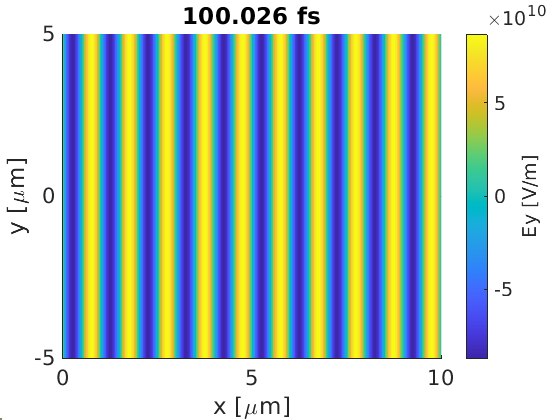

It can sometimes be useful to restart an **EPOCH** simulation from an SDF file. 
Supercomputers may often place limits on job length, or systems may be prone to
crashing, so code-restarts can help prevent CPU waste.

Using the **EPOCH** [output block](/documentation/input_deck/input_deck_output_block.html),
the user is able to force the code to write restart-dumps. These differ from 
regular dumps, as they write all the particle and field properties required to
restart the simulation. These will quite often be large and slow files to write,
so there is a trade-off between simulation speed (no restarts) and safety (many 
restart dumps).

In this page we will simulate a basic laser injected into a vacuum, and run the 
simulation with and without restarts.

## Simulation set-up {#no_restart}

Here we provide the input deck for a basic 2D simulation where a plane wave 
enters 
the simulation window through the `x_min` boundary. This creates an SDF file
containing the `Ey` field every 10 fs. This is a lightweight diagnostic, and 
is not sufficient to restart the whole simulation. A plot of the electric field
from the `0010.sdf` file is also present, along with the MATLAB script which 
created it (other post-processing tools are available). Instructions on running 
EPOCH input decks are provided [here](/quickstart.html).

```
begin:control
  nx = 500
  ny = 500
  t_end = 100 * femto
  x_min = 0.0
  x_max = 10.0e-6
  y_min = -5.0e-6
  y_max = 5.0e-6
  stdout_frequency = 10
end:control

begin:boundaries
  bc_x_min = simple_laser
  bc_x_max = open
  bc_y_min = periodic
  bc_y_max = periodic
end:boundaries

begin:laser
  boundary = x_min
  intensity_w_cm2 = 1.0e15
  lambda = 1.0e-6
  profile = 1.0
  t_profile = 1.0
end:laser

begin:output
  dt_snapshot = 10.0e-15
  ey = always
end:output
```

This code took 3 seconds to run on a 4 core laptop. For the MATLAB
post-processing, the contents of `epoch/SDF/MATLAB` were copied into the
directory containing the SDF files and `input.deck`, and a plot was generated 
using this script:

```MatLab
% Extract data
data = GetDataSDF('0010.sdf');

% Format grid
x_edges = data.Electric_Field.Ey.grid.x;
y_edges = data.Electric_Field.Ey.grid.y;
x_centres = 0.5*(x_edges(2:end) + x_edges(1:end-1));
y_centres = 0.5*(y_edges(2:end) + y_edges(1:end-1));
[x_plot, y_plot] = meshgrid(x_centres, y_centres);

% Create and format plot
surf(x_plot*1.0e6, y_plot*1.0e6, data.Electric_Field.Ey.data','EdgeColor','none');
view(2);
xlabel('x [\mum]');
ylabel('y [\mum]');
cbar = colorbar;
cbar.Label.String = 'Ey [V/m]';
ax = gca;
ax.FontSize = 16;
title(sprintf('%g fs',data.time*1.0e15));
```



## Restarting from simulation end

Now we have a basic script, let us run it in two simulations loading the second
from a restart-dump. In our first run, we will reduce the run-time to 50 fs, and
force the final dump to be restartable. We will start the second simulation from
the 50 fs restart-dump, and run to completion.

For the first run, take the previous `input.deck` and make some changes.
Firstly, change `t_end` in the control block from `100 * femto` to `50 * femto`. 
Next, add the following line to the output block:

```
force_final_to_be_restartable = T
```

When we run this simulation, we find that we generate output files from 
`0000.sdf` to `0005.sdf`. If we inspect the file-sizes, we'll see that 
`0005.sdf` has a size of 18 MB, while the rest have 2 MB - our restart-dump file
is much larger.

For the restarted run, change `t_end` in the control block back to 
`100 * femto`, and add the control block line:

```
restart_snapshot = 5
```

When running the restarted deck, **EPOCH** will print the lines:

```
 Loading snapshot for time   5.0012906556442301E-014
 Input file contains          29 blocks
 Load from restart dump OK
```

if run successfully. You'll see the SDF files continue from where they left off,
and if we were to once again print the `Ey` field at `0010.sdf`, we once again
find what we had before:


## Restart checkpoints

The previous example assumed you could split your simulation up into obvious
chunks, but what if the nodes you run on have a tendency to crash? In this case,
it would make more sense to make multiple restart dumps. While this could be 
achieved by replacing `force_final_to_be_restartable` with `restart_dump_every` 
to make multiple restart dumps, you may want to separate your restart dumps from
your usual dumps. This can be done using multiple output blocks.

The previous example has been extended to produce two sets out output files, one 
labelled `normal0000.sdf` to `normal0010.sdf`, and the other labelled 
`restart0000.sdf` to `restart0005.sdf`.

```
begin:control
  nx = 500
  ny = 500
  t_end = 100 * femto
  x_min = 0.0
  x_max = 10.0e-6
  y_min = -5.0e-6
  y_max = 5.0e-6
  stdout_frequency = 10
end:control

begin:boundaries
  bc_x_min = simple_laser
  bc_x_max = open
  bc_y_min = periodic
  bc_y_max = periodic
end:boundaries

begin:laser
  boundary = x_min
  intensity_w_cm2 = 1.0e15
  lambda = 1.0e-6
  profile = 1.0
  t_profile = 1.0
end:laser

begin:output
  name = normal
  file_prefix = normal
  dt_snapshot = 10.0e-15
  ey = always
end:output

begin:output
  name = restart
  file_prefix = restart
  restartable = T
  dt_snapshot = 20.0e-15
end:output
```

Once we have this, we can restart from any of the restart SDF files. Because 
these files now have a prefix, we must add a line like:

```
restart_snapshot = restart0004.sdf
```

to the control block, where we use the full file-name.

## Restart at end of the cluster job allocation

The issue with regular checkpoints is that it may be overkill for your job, and 
any CPU time spent after the final checkpoint is wasted when you come to 
restart. Also, writing a restart dump at the end of a simulation is less useful 
when you run on supercomputers, as you don't know where you'll be at the end of
your maximum job time!

In this case, you need a way to automatically stop the simulation as you near 
the end of your allotted time, and _then_ write a restart dump so you can 
continue later. This can be achieved using the `STOP` file.

While running, **EPOCH** continuously scans the directory containing 
`input.deck` for a file with a filename `STOP`. When this file appears, 
**EPOCH** completes the current time-step, writes a restart dump, ends the
simulation, and deletes the `STOP` file.

For example, if you were to submit an **EPOCH** job on a super-computer with an 
allocated time of 5 hours, and you wanted the code to stop at 4 hours 30 mins 
(leaving you 30 minutes to write a restart dump), you could add the line:

```
(sleep 16200; touch STOP) &
```

to your job-script just before **EPOCH** is run. This will create a background 
process which will wait 16200 seconds, then create the `STOP` file in the 
working directory of the original command. If this is the same directory as your
input deck, 
this will stop the code with (hopefully) enough time to write the restart dump. 
You may want to check in advance how long a restart dump takes to write for your 
project.